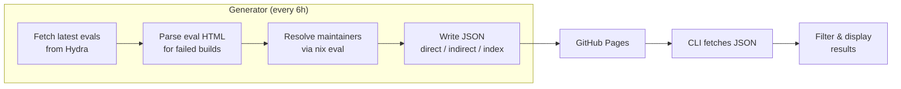

<p align="center">
  
</p>

<div align="center">

# ZHF-CLI

A CLI tool for querying [NixOS](https://nixos.org/) / [nixpkgs](https://github.com/NixOS/nixpkgs) build failures from [Hydra CI](https://hydra.nixos.org/), built to help maintainers during the [Zero Hydra Failures](https://nixos.org/manual/nixpkgs/stable/#chap-submitting-changes) campaign. Also useful outside of ZHF for checking what's currently failing on Hydra.

<p>
  <a href="https://hydra.nixos.org/"></a>
</p>

</div>

## Usage

Run directly via Nix flake:

```bash
nix run github:MiniHarinn/zhf-cli -- --help
```

Or from a local checkout:

```bash
nix run -- --help
```

### Examples

```bash
# Show build stats across channels
nix run github:MiniHarinn/zhf-cli -- stats

# List direct failures on x86_64-linux
nix run github:MiniHarinn/zhf-cli -- direct --fails-on x86_64-linux

# Find failures for a specific maintainer
nix run github:MiniHarinn/zhf-cli -- direct --maintainer someuser

# Find packages with no maintainer
nix run github:MiniHarinn/zhf-cli -- direct --no-maintainer

# Export results as CSV
nix run github:MiniHarinn/zhf-cli -- direct --export failures.csv

# Query a specific channel
nix run github:MiniHarinn/zhf-cli -- direct --channel nixos:unstable
```

## How it works

Querying Hydra directly for all failed builds is slow and resource-intensive, and those resources are better spent on actual builds. To avoid that, a **generator** runs on GitHub Actions every 6 hours, pulling failure data from Hydra once and publishing it to GitHub Pages. The **CLI** then fetches that pre-built data instead of hitting Hydra directly.



The generator parses Hydra's eval HTML instead of the JSON API, which times out on large evals (280k+ builds). Maintainer info is resolved by running `nix eval` against the pinned nixpkgs commit from each eval.

### Note to Hydra maintainers

The generator only runs every 6 hours via GitHub Actions and makes a small number of requests per run. If this is still causing issues for Hydra (User-Agent: `zhf-generator/0.1`), please reach out at `matrix:@harinn:matrix.org`.

## Contributing

PRs are welcome! Please use [Conventional Commits](https://www.conventionalcommits.org/en/v1.0.0/).

---

<p align="center">Made with ❤️ by <a href="https://github.com/MiniHarinn">@MiniHarinn</a></p>
